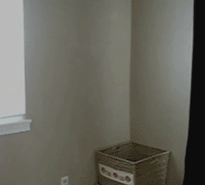
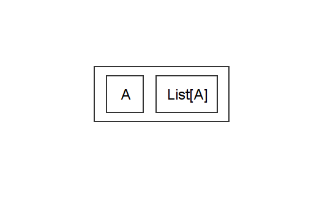
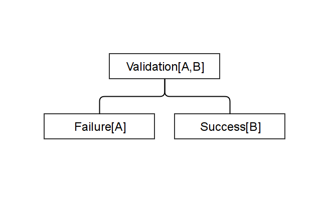
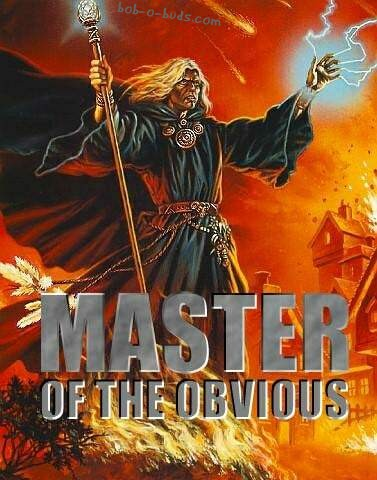

% TDD, as in Type-Directed Development
% Clément Delafargue
% 2014-04-11

-------------------------------------------

<span style="font-size: 5.5em;">&lambda;</span>

-------------------------------------------


-------------------------------------------

```java

public int addFiveAction(
  params: Map<String, String>) {

    String nbS = params.get("number");
    if(!nbS.isEmpty()) {
        int nb = Integer.parseInt(nbS);
        return nb + 5;
    } else {
        return 0;
    }
}

```

-------------------------------------------

```java

addFiveAction({ "number": "12" });
    // 17

addFiveAction({ "yolo": "12" });
    // java.lang.NullPointerException

addFiveAction({ "number": "yolo" })
    // java.lang.NumberFormatException

```

-------------------------------------------



-------------------------------------------

<div style="font-size: 0.8em;">

```java

int addFiveAction(
  params: Map<String, String>) {
    String nbS = params.get("number");

    if(nbS != null) {
        if(!nbS.isEmpty()) {
            try {
                int nb = Integer.parseInt(nbS)
                return nb;
            } catch(NumberFormatException e) {
                return 0;
            }
        }
    } else {
        return 0;
    }
}

```
</div>

-------------------------------------------

<div style="font-size: 0.5em;">

```java

int addFiveAction(
  params: Map<String, String>) {
    String nbS1 = params.get("n1");
    String nbS2 = params.get("n2");

    if(nbS1 != null) {
        if(!nbS1.isEmpty()) {
            try {
                int nb1 = Integer.parseInt(nbS1)
                if(nbS2 != null) {
                    if(!nbS2.isEmpty()) {
                        try {
                            int nb2 = Integer.parseInt(nbS2);
                            return nb1 + nb2;
                        } catch(NumberFormatException e) {
                            return 0;
                        }
                    }
                }
            } catch(NumberFormatException e) {
                return 0;
            }
        }
    } else {
        return 0;
    }
}

```
</div>

-------------------------------------------


-------------------------------------------


-------------------------------------------


```scala

def parseInt(str: String):
  Option[Int]

def get(
  index: String,
  vals: Map[String, String]
): Option[String]
```

-------------------------------------------

```scala
def getInt(
    index: String,
    vals: Map[String, String]
): Option[Int]
```


-------------------------------------------

<div style="font-size: 0.9em;">
```scala
def addNumbersAction(
  params: Map[String, String]
): Int = {
    val i1 = getInt("n1", params)
    val i2 = getInt("n2", params)
    i1.getOrElse(0) + i2.getOrElse(0)
}

```

</div>

-------------------------------------------


-------------------------------------------

Non-empty list



-------------------------------------------



-------------------------------------------



-------------------------------------------


-------------------------------------------

Why not tests?

-------------------------------------------

<span style="font-size: 5.5em;">&exist;</span>

« there exists »

-------------------------------------------

<span style="font-size: 5.5em;">&forall;</span>

« for all »

-------------------------------------------


-------------------------------------------

Type inference

-------------------------------------------

<div style="font-size: 1.5em;">

```haskell

val myVar =
    "obviously a string"

val myVar = List( "obviously"
        , "a"
        , "list"
        , "of"
        , "strings"
        )

```
</div>

-------------------------------------------

Type &hArr; Property

Program &hArr; Proof

-------------------------------------------


-------------------------------------------

Expressive type systems

-------------------------------------------

Parametricity

-------------------------------------------

<div style="font-size: 1.7em;">

```scala

def reverse(
  xs: List[A]
): List[A]

```
</div>

-------------------------------------------

# Type-Directed Development

-------------------------------------------

Confidence

-------------------------------------------

Small bites

-------------------------------------------

Types are the best doc

Hoogle

-------------------------------------------

Types can't always prove everything

-------------------------------------------

And that's ok

-------------------------------------------

<div style="font-size: 1.2em;">

```haskell

reverseProp ::
    Eq a =>
    [a] -> [a] -> Bool
reverseProp xs ys =
    reverse (xs ++ ys) ==
        reverse ys ++ reverse xs
```

    λ> quickCheck reverseProp
    +++OK, passed 100 tests.

</div>

-------------------------------------------

Types *then*

Property-based tests *then*

Unit tests

-------------------------------------------

Thanks

-------------------------------------------

[Parametricity](http://dl.dropboxusercontent.com/u/7810909/media/doc/parametricity.pdf)

<http://haskell.org>

<http://scala.org>

<http://rustlang.org>

