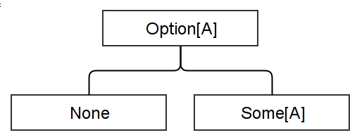
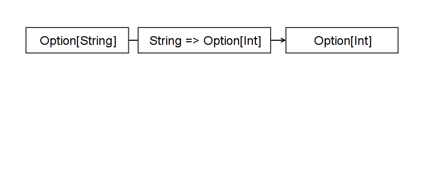
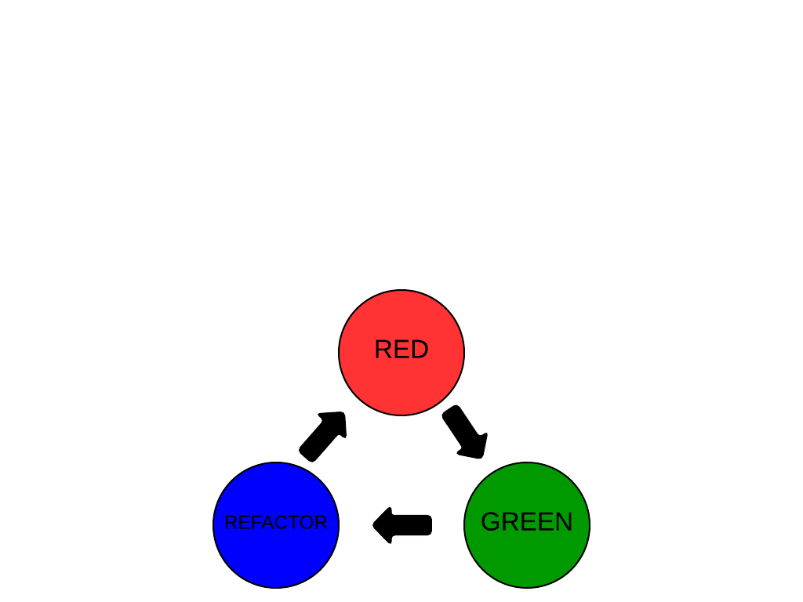
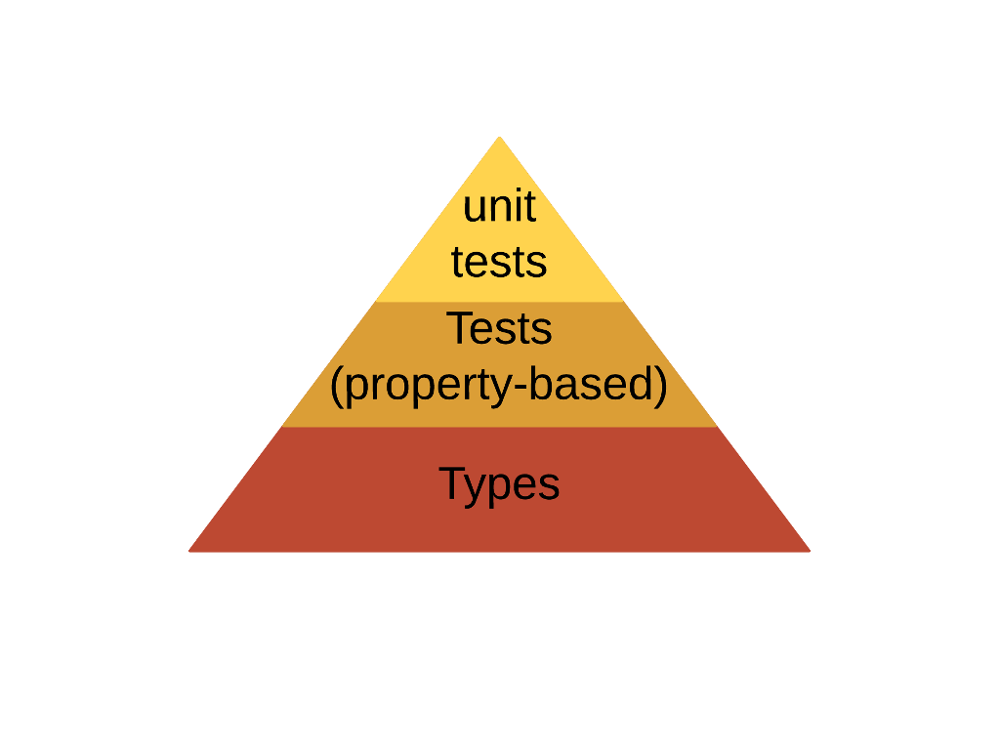

% TDD, as in <span class="red">Type</span>-Directed Development
% Clément Delafargue
% TDD Geecon 2015-01-30

-------------------------------------------

# I'm online!

 - [\@clementd](https://twitter.com/clementd) on twitter
 - [cltdl.fr/blog](https://cltdl.fr/blog)
 - [clever cloud](http://clever-cloud.com)

-------------------------------------------


-------------------------------------------

<span style="font-size: 5.5em;">λ</span>

-------------------------------------------


-------------------------------------------

## Example time

-------------------------------------------

# Example time

    GET /endpoint?number=5

    10

-------------------------------------------

```scala

def addFiveAction(
    params: Map[String, String]
) = {

    val nbS = params("number")
    if(nbS != "") {
        val nb = nbS.toInt
        nb + 5
    } else {
        0
    }
}

```

-------------------------------------------

```scala

addFiveAction(Map("number" -> "12"));
    // 17

addFiveAction(Map("yolo" -> "12"));
    // java.lang.NullPointerException

addFiveAction(Map("number" -> "yolo"));
    // java.lang.NumberFormatException

```

-------------------------------------------

# Pokemon Driven Development
<video src="../../stuff-indexes/lol/cat-clothes.webm" loop/>

-------------------------------------------

<div style="font-size: 0.8em;">

```scala

def addFiveAction(
  params: Map[String, String]) = {
    val nbS = params("number")

    if(nbS != null) {
        if(!nbS != "") {
            try {
                val nb = nbS.toInt
                nb + 5
            } catch {
                case e: NumberFormatException e => 0
            }
        }
    } else {
        0
    }
}

```
</div>

# De plous en plous difficile

    GET /endpoint?n1=20&n2=22

    42
-------------------------------------------

<div style="font-size: 0.5em;">

```scala

def addNumbersAction(
  params: Map[String, String]) = {
    val nbS1 = params("n1");
    val nbS2 = params("n2");

    if(nbS1 != null) {
        if(!nbS1 != "") {
            try {
                val nb1 = nbS1.toInt
                if(nbS2 != null) {
                    if(!nbS2 != "") {
                        try {
                            val nb2 = nbS2.toInt
                            nbS1 + nbS2
                        } catch {
                            case e: NumberFormatException => 0
                        }
                    }
                }
            } catch {
                case e: NumberFormatException => 0
            }
        }
    } else {
        0
    }
}

```
</div>

-------------------------------------------


-------------------------------------------

## Thinking with types

-------------------------------------------

## From a map, I can get a value…

-------------------------------------------

## maybe

-------------------------------------------

```scala
def getKeyAt(
  values: Map[String, String],
  key: String
): MaybeString
```

-------------------------------------------

## from a string, I can get an int…

-------------------------------------------

## maybe

-------------------------------------------

```scala
def parseInt(
  string: String
): MaybeInt
```

-------------------------------------------



-------------------------------------------


```scala
def parseInt(str: String):
  Option[Int]

map[A,B]#get(key: A): Option[B]
```

-------------------------------------------

```scala
def getInt(
    index: String,
    vals: Map[String, String]
): Option[Int]
```

-------------------------------------------



-------------------------------------------

<div style="font-size: 0.9em;">
```scala
def addNumbersAction(
  params: Map[String, String]
): Int = {
    val i1 = getInt("n1", params)
    val i2 = getInt("n2", params)
    i1.getOrElse(0) + i2.getOrElse(0)
}

```

</div>

-------------------------------------------

<div style="font-size: 0.5em;">

```scala

def addNumbersAction(
  params: Map[String, String]) = {
    val nbS1 = params("n1");
    val nbS2 = params("n2");

    if(nbS1 != null) {
        if(!nbS1 != "") {
            try {
                val nb1 = nbS1.toInt
                if(nbS2 != null) {
                    if(!nbS2 != "") {
                        try {
                            val nb2 = nbS2.toInt
                            nbS1 + nbS2
                        } catch {
                            case e: NumberFormatException => 0
                        }
                    }
                }
            } catch {
                case e: NumberFormatException => 0
            }
        }
    } else {
        0
    }
}

```
</div>

-------------------------------------------

<video src="../../stuff-indexes/lol/computer-ok.webm" loop/>

-------------------------------------------

## Correct

-------------------------------------------

## by construction

-------------------------------------------

<video src="../../stuff-indexes/lol/obviously.webm" loop/>

-------------------------------------------

## Why not tests?

-------------------------------------------

## Why not <span class="red">*only*</span> tests?

-------------------------------------------

<span style="font-size: 5.5em;">∃</span>

« there exists »

-------------------------------------------

<span style="font-size: 5.5em;">∀</span>

« for all »

-------------------------------------------

## Type &hArr; Property

-------------------------------------------

## Program &hArr; Proof

-------------------------------------------

# <br/><br />  <small>provably > probably</small>

-------------------------------------------

## Expressive type systems

-------------------------------------------

## Parametricity

-------------------------------------------

## Parametricity <br /> (aka generics)

# Ignorance is bliss

<video src="../../stuff-indexes/lol/i-dont-care.webm" loop/>

# Parametricity

<div class="text big">

```scala
def f[A](x: A): A
```
</div>

# Parametricity

<div class="text big">

```scala
def compose[A,B,C](
    g: (B => C),
    f: (A => B)
): (A => C)
```
</div>

# Parametricity

```scala
def rev[A](xs: List[A]): List[A]
```

-------------------------------------------

### `rev(Nil)` <br /> `==` <br/> `Nil`

-------------------------------------------

### `x in rev(a) => x in a`

# Theorems for free
<video src="../../stuff-indexes/lol/money-shower.webm" loop/>

-------------------------------------------
  
  
  
```scala
trait List[A] {
    def filter(p: A => Boolean): List[A]

    def map[B](f: A => B): List[B]
}

l.filter(compose(p,f)).map(f) ==
l.map(f).filter(p)
```

-------------------------------------------

## Discipline

-------------------------------------------

# no `null`s
<video src="../../stuff-indexes/lol/bang-boom.webm" loop/>

-------------------------------------------

## type  &hArr; property

-------------------------------------------

## proof  &hArr; program

-------------------------------------------

## `null` can inhabit any type

-------------------------------------------

## `null` can prove any property

# no reflection
<video src="../../stuff-indexes/lol/bicycle-gorilla.webm" loop/>

-------------------------------------------

### reflection breaks blissful ignorance

-------------------------------------------

# Reflection

<div class="text big">
```scala
def f[A](x: A): String
```
</div>

-------------------------------------------

<div class="text big bottom">
```scala
def f[A](x: A): String =

x match {
  case v: String => v
  case v: Int => "int"
  case _ => "whatever"
}
```
</div>

# toString / equals / hashCode
<video src="../../stuff-indexes/lol/driving-fail.webm" loop/>

-------------------------------------------

<div class="text big">
```scala
def f[A](x: A): String =
x.toString
```
</div>


# no exceptions
<video src="../../stuff-indexes/lol/retards.webm" loop/>

# Side effects


# side-effects

```scala
def f[A](x: A): String = {
  launchBallisticMissile()

  System.getenv("JAVA_HOME")
}
```

-------------------------------------------

# Fast and loose reasoning is morally correct

# <span class="red">Type</span>-Directed Development

# Not a silver bullet
<video src="../../stuff-indexes/lol/itworks.webm" loop/>

# Just helpful
<video src="../../stuff-indexes/lol/fabulous.webm" loop/>

# Confidence
<video src="../../stuff-indexes/lol/bungee_explosion.webm" loop/>

-------------------------------------------

## Big Refactoring

-------------------------------------------

## Dependencies update

-------------------------------------------

## Play Framework

-------------------------------------------

## Scalaz 6.x -> 7.x

-------------------------------------------

## DB access library

-------------------------------------------

### It typechecks, ship it


# Modular thinking

<video src="../../stuff-indexes/lol/hamsters.webm" loop/>

-------------------------------------------

## Not just about safety
<video src="../../stuff-indexes/lol/fire-trick.webm" loop/>

# Types lay out algorithms
<video src="../../stuff-indexes/lol/gym.webm" loop/>

# Hole-Driven-Development
<video src="../../stuff-indexes/lol/abyss.webm" loop/>

-------------------------------------------

```scala
case object Hole

def compose[A,B,C](
    g: (B => C),
    f: (A => B)
): (A => C) = Hole

Hole: A => C
```


-------------------------------------------

```scala

def compose[A,B,C](
    g: (B => C),
    f: (A => B)
): (A => C) = (x: A) => Hole

x: A
Hole: C
```


-------------------------------------------

```scala

def compose[A,B,C](
    g: (B => C),
    f: (A => B)
): (A => C) = (x: A) => g(Hole)

X: A
Hole: B
```

-------------------------------------------


```scala

def compose[A,B,C](
    g: (B => C),
    f: (A => B)
): (A => C) = (x: A) => g(f(Hole))

x: A
Hole: A
Hole = x
```

-------------------------------------------

```scala

def compose[A,B,C](
    g: (B => C),
    f: (A => B)
): (A => C) = (x: A) => g(f(x))

```

-------------------------------------------

```scala

def fmap[A,B](
    f: (A => B),
    xs: List[A]
): List[B] = Hole

Hole: List[B]
```

-------------------------------------------

```scala

def fmap[A,B](
    f: (A => B),
    xs: List[A]
): List[B] = xs match {
    case Nil => Nil
    case (head :: tail) =>
        Hole1 :: Hole2
}

head: A
tail: List[A]
Hole1: B
Hole2: List[B]
```

-------------------------------------------

```scala

def fmap[A,B](
    f: (A => B),
    xs: List[A]
): List[B] = xs match {
    case Nil => Nil
    case (head :: tail) =>
        f(head) :: fmap(f, tail)
}
```

# Test-Driven Development



# <span>Type</span>-Driven Development


-------------------------------------------

### Types make communication easy

# With machines

<video src="../../stuff-indexes/lol/cyberman_dance.webm" loop/>

-------------------------------------------

## Type checking

-------------------------------------------

# Tooling
<video src="../../stuff-indexes/lol/hammer.webm" loop/>

-------------------------------------------

<div style="background-color: blue; width: 100%; height: 100%">
### <span style="font-family: 'Comic Sans MS'; color: yellow;">Haskell type syntax</span>
</div>

-------------------------------------------

## `a -> a`

-------------------------------------------

## `Int -> Int`

-------------------------------------------

## `a -> b -> a`

-------------------------------------------

## `a -> (b -> a)`

-------------------------------------------

## `(Ord a) =>`<br/>`[a] -> [a]`

-------------------------------------------

## Intent

-------------------------------------------

# Hoogle \<3 \<3

<http://www.haskell.org/hoogle>

-------------------------------------------

## Remove duplicates

-------------------------------------------

### `Eq a =>` <br /> `[a] -> [a]`

-------------------------------------------

<video src="assets/hoogle-nub.webm" controls/>

-------------------------------------------

### `[Maybe a] ->` <br /> `Maybe [a]`

-------------------------------------------

<video src="assets/hoogle-sequence.webm" controls/>

# With humans

<video src="../../stuff-indexes/lol/dumb_dumber.webm" loop/>

-------------------------------------------

# Types can't always prove everything

-------------------------------------------

## And that's ok

-------------------------------------------

<div class="text big">
```scala

def reverse[A](
    xs: List[A]
): List[A]
```
</div>

-------------------------------------------

<div style="font-size: 1.2em;">

```scala

def reverseProp[A: Equal](
  xs: List[A],
  ys: List[A]
) = {

    reverse(xs ++ ys) ==
    reverse(ys) ++ reverse(xs)
}
```

</div>

# Property-based reasoning

# Perfect for edge cases

-------------------------------------------

Types *then*

Property-based tests *then*

Unit tests

-------------------------------------------



-------------------------------------------

## Model data as records

-------------------------------------------

## Lay out the function types

-------------------------------------------

## Write property-based tests

-------------------------------------------

### Types + Operations + Laws

-------------------------------------------

<video src="../../stuff-indexes/lol/oh-yeah.webm" loop/>

# Algebra


-------------------------------------------

## Implement

-------------------------------------------

## Unit test for regressions

-------------------------------------------

## ???

-------------------------------------------

## Profit


-------------------------------------------

## Types are

-------------------------------------------

## Safety feature

-------------------------------------------

## High level reasoning tool

-------------------------------------------

## Communication tool

-------------------------------------------

## Let's use them
<video src="../../stuff-indexes/lol/banco.webm" loop/>

# Read this

 - TAPL
 - PFPL

# Read this

 - [Functional and Reactive Domain Modeling](http://manning.com/ghosh2/)
 - [Parametricity](http://dl.dropboxusercontent.com/u/7810909/media/doc/parametricity.pdf)
 - [Theorems for free](http://ttic.uchicago.edu/~dreyer/course/papers/wadler.pdf)

# Thanks
<video src="../../stuff-indexes/lol/axolotl.webm" loop/>

-------------------------------------------

 - [\@clementd](https://twitter.com/clementd) on twitter
 - [cltdl.fr/blog](https://cltdl.fr/blog)
 - [clever-cloud.com](http://clever-cloud.com)
