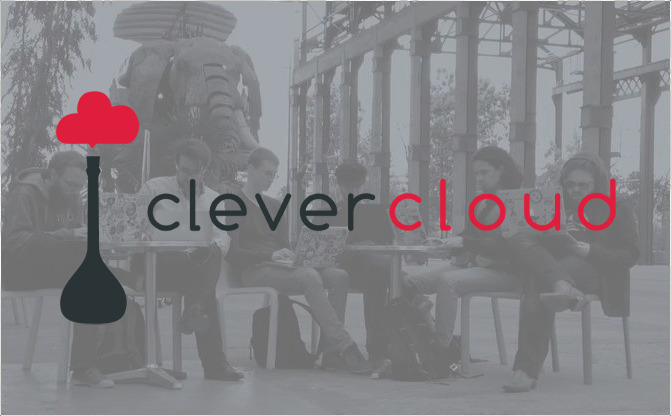

% TDD as in Type-Directed Development
% Clément Delafargue
% scala.io 2014-10-24

-------------------------------------------



-------------------------------------------

<span style="font-size: 5.5em;">λ</span>


-------------------------------------------


-------------------------------------------

```scala

def addFiveAction(
    params: Map[String, String]
) = {

    val nbS = params("number")
    if(nbS != "") {
        val nb = nbS.toInt
        nb + 5
    } else {
        0
    }
}

```

-------------------------------------------

```scala

addFiveAction(Map("number" -> "12"));
    // 17

addFiveAction(Map("yolo" -> "12"));
    // java.lang.NullPointerException

addFiveAction(Map("number" -> "yolo"));
    // java.lang.NumberFormatException

```

-------------------------------------------

# Pokemon Driven Development
<video src="../../stuff-indexes/lol/cat-clothes.webm" autoplay loop/>

-------------------------------------------

<div style="font-size: 0.8em;">

```scala

def addFiveAction(
  params: Map[String, String]) = {
    val nbS = params("number")

    if(nbS != null) {
        if(!nbS != "") {
            try {
                val nb = nbS.toInt
                nb + 5
            } catch {
                case e: NumberFormatException e => 0
            }
        }
    } else {
        0
    }
}

```
</div>

-------------------------------------------

<div style="font-size: 0.5em;">

```scala

def addNumbersAction(
  params: Map[String, String]) = {
    val nbS1 = params("n1");
    val nbS2 = params("n2");

    if(nbS1 != null) {
        if(!nbS1 != "") {
            try {
                val nb1 = nbS1.toInt
                if(nbS2 != null) {
                    if(!nbS2 != "") {
                        try {
                            val nb2 = nbS2.toInt
                            nbS1 + nbS2
                        } catch {
                            case e: NumberFormatException => 0
                        }
                    }
                }
            } catch {
                case e: NumberFormatException => 0
            }
        }
    } else {
        0
    }
}

```
</div>

-------------------------------------------


-------------------------------------------


-------------------------------------------


```scala

def parseInt(str: String):
  Option[Int]

map[A,B]#get(key: A): Option[B]
```

-------------------------------------------

```scala
def getInt(
    index: String,
    vals: Map[String, String]
): Option[Int]
```

-------------------------------------------


-------------------------------------------

<div style="font-size: 0.9em;">
```scala
def addNumbersAction(
  params: Map[String, String]
): Int = {
    val i1 = getInt("n1", params)
    val i2 = getInt("n2", params)
    i1.getOrElse(0) + i2.getOrElse(0)
}

```

</div>

-------------------------------------------

<video src="../../stuff-indexes/lol/computer-ok.webm" autoplay loop/>

-------------------------------------------


<div style="font-size: 1.5em;">
```scala
List[A: Ordering]#max: A
```
</div>

-------------------------------------------

<div style="font-size: 0.9em;">

```scala
scala> List[Int]().max

java.lang.UnsupportedOperationException:
empty.max
```
</div>


-------------------------------------------

Non-empty list


-------------------------------------------


# Have a look at scalaz


-------------------------------------------

- Validation
- \\/
- NonEmptyList
- Task

-------------------------------------------

<video src="../../stuff-indexes/lol/obviously.webm" autoplay loop/>

-------------------------------------------

<video src="../../stuff-indexes/lol/computer-no.webm" autoplay loop/>


# Why not tests?

# Why not only tests?

-------------------------------------------

<span style="font-size: 5.5em;">∃</span>

« there exists »

-------------------------------------------

<span style="font-size: 5.5em;">∀</span>

« for all »

-------------------------------------------

Type &hArr; Property

Program &hArr; Proof

-------------------------------------------

# provably > probably


# Expressive type systems

-------------------------------------------

# Parametricity

-------------------------------------------


```scala

def f(
    x: A
): A

```

-------------------------------------------

```scala

def compose[A,B,C](
    g: (B => C),
    f: (A => B)
): (A => C)

```
-------------------------------------------

```scala

def reverse[A](
    xs: List[A]
): List[A]

```
-------------------------------------------

# Theorems for free
<video src="../../stuff-indexes/lol/money-shower.webm" autoplay loop/>

-------------------------------------------

```scala
trait List[A] {
    def filter(p: A => Boolean): List[A]

    def map[B](f: A => B): List[B]
}

l.filter(compose(p,f)).map(f) ==
l.map(f).filter(f)
```

-------------------------------------------


# null
<video src="../../stuff-indexes/lol/bang-boom.webm" autoplay loop/>

# reflection
<video src="../../stuff-indexes/lol/bicycle-gorilla.webm" autoplay loop/>

# exceptions
<video src="../../stuff-indexes/lol/retards.webm" autoplay loop/>

# toString / equals / hashCode
<video src="../../stuff-indexes/lol/driving-fail.webm" autoplay loop/>

# Side effects
<video src="../../stuff-indexes/lol/nazi-chainsaw.webm" autoplay loop/>


# Fast and loose reasoning is morally correct

# Scala collections are morally disturbing
<video src="../../stuff-indexes/lol/bad-panda.webm" autoplay loop/>

-------------------------------------------


# Type-Directed Development

# Confidence

# Small bites
<video src="../../stuff-indexes/lol/parallel-chew.webm" autoplay loop/>

# Hole-Driven-Development
<video src="../../stuff-indexes/lol/abyss.webm" autoplay loop/>

-------------------------------------------

```scala
case object Hole

def compose[A,B,C](
    g: (B => C),
    f: (A => B)
): (A => C) = Hole

```

Hole has type `A => C`

-------------------------------------------

```scala

def compose[A,B,C](
    g: (B => C),
    f: (A => B)
): (A => C) = (x: A) => Hole

```

`x` has type `A`

Hole has type `C`

-------------------------------------------

```scala

def compose[A,B,C](
    g: (B => C),
    f: (A => B)
): (A => C) = (x: A) => g(Hole)

```

`X` has type `A`

Hole has type `B`

-------------------------------------------


```scala

def compose[A,B,C](
    g: (B => C),
    f: (A => B)
): (A => C) = (x: A) => g(f(Hole))

```
`x` has type `A`

Hole has type `A`

`Hole = x`

-------------------------------------------

```scala

def compose[A,B,C](
    g: (B => C),
    f: (A => B)
): (A => C) = (x: A) => g(f(x))

```

# Types are the best doc

Hoogle
<http://www.haskell.org/hoogle>


# Types can't always prove everything

# And that's ok

-------------------------------------------

```scala

def reverse[A](
    xs: List[A]
): List[A]

```
-------------------------------------------

<div style="font-size: 1.2em;">

```scala

def reverseProp[A: Equal](
  xs: List[A],
  ys: List[A]
) = {

    reverse(xs ++ ys) ==
    reverse(ys) ++ reverse(xs)
}
```

</div>

# Property-based reasoning

# Perfect for edge cases

-------------------------------------------

Types *then*

Property-based tests *then*

Unit tests

# Model data as case classes

# Lay out the function types

# Write property-based tests

# Implement

# Unit test


# Thanks

-------------------------------------------

[Parametricity](http://dl.dropboxusercontent.com/u/7810909/media/doc/parametricity.pdf)

<http://haskell.org>

<http://scala.org>

<http://rustlang.org>

